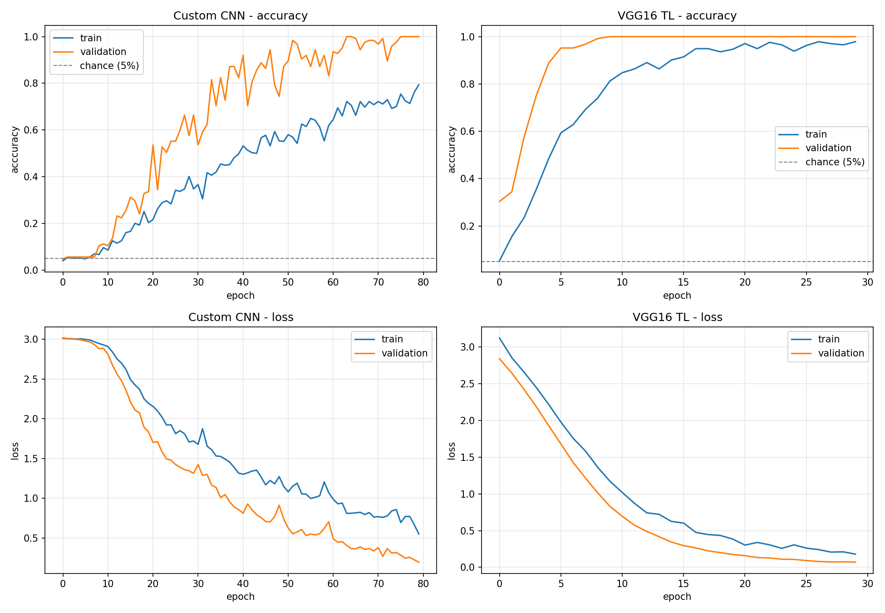
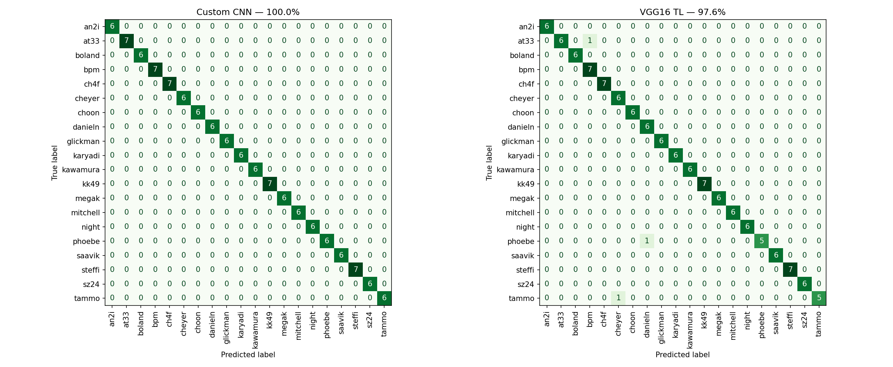
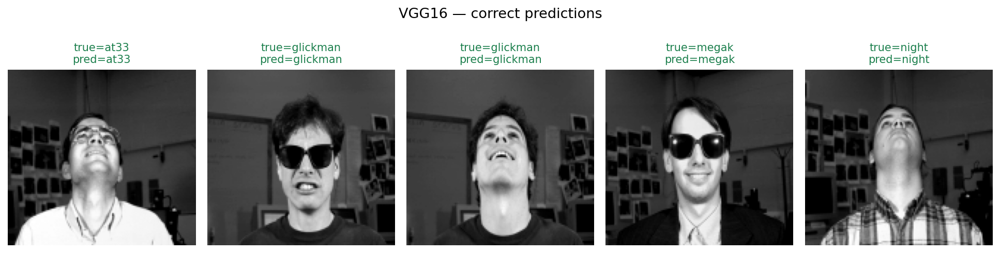
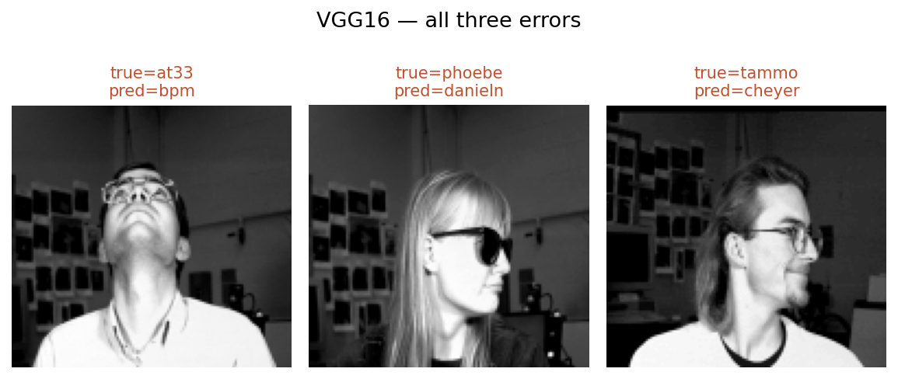

[README.md](https://github.com/user-attachments/files/32708006/README.md)
# Teaching a Computer to Recognise Faces — and Finding Out Why It Seemed to Fail

This project trains a computer to look at a photograph of someone's face and say who it is. There are 20 people in the dataset, so a machine guessing at random would be right about 5% of the time.

A model I built earlier scored exactly 5%. That looked like total failure.

It wasn't. The models had learned to recognise faces almost perfectly. This repository is the investigation and the fix.

| | Originally reported | Actually achieves |
|---|---|---|
| A small network built from scratch | 5.04% | **100%** |
| A large pre-trained network (VGG16) | 5.04% | **97.6%** |
| A simple statistical method from 1991 | never tried | **99.2%** |

Tested on 125 photographs the models had never seen.

---

## How a working model can look like a broken one

Two separate faults produced the same misleading result.

### Fault one: marking against the wrong answer key

Imagine marking an exam. You have the students' answers and you have the answer key. But through a slip, you write "A" beside every question on the key. Now everyone who wrote anything other than A is marked wrong, no matter how well they actually did.

That is close to what happened here. One line of code was meant to read the correct labels (*this is person 7, this is person 12*) but a mistake in how it handled the data turned every label into *person 1*. The models' answers were fine. They were being compared against a corrupted key.

### Fault two: a component that behaves differently in practice than in training

Neural networks often include a part called batch normalisation, which keeps the numbers flowing through the network within a sensible range. It does this one way while the model is learning and a slightly different way once the model is finished and being used for real.

To switch between the two, it needs to build up an average across many examples. With only 374 training photographs it never gathered enough for that average to settle. So the model learned well — and then, the moment it was asked to identify someone for real, it was working from unreliable internal numbers.

The symptom was oddly specific: the model got steadily better at the photographs it was learning from while getting steadily *worse* at everything else. Removing that component moved the score from 9.6% to 100%.

---

## The check that would have caught it in a minute

Before training anything complicated, this project now runs a deliberately simple method first.

It's called Eigenfaces. It dates from 1991, uses no neural network at all, and finishes in under a minute. On this dataset it identifies **99.2%** of faces correctly.

That number is the safety net. If a technique from 1991 can identify almost everyone, and a modern neural network reports 5%, then the problem cannot be the task and cannot be the photographs. It has to be the code.

The original project went straight to the complicated models. When they appeared to fail there was nothing to compare against, so the failure looked as though it might be the dataset's fault. It wasn't.

If there's one habit worth taking from this project, it's that one: **prove something simple works before concluding that something complicated has failed.**

---

## Results



These charts show both models improving as they train. One thing looks wrong at first glance: the orange line (photographs held back for checking) sits *above* the blue line (photographs used for learning). That's expected here. During training the photographs are deliberately distorted 'flipped, brightened, darkened' to make the task harder and the model more robust. The held-back photographs are clean, and therefore easier.



This grid shows every prediction made. The diagonal running corner to corner is correct answers; anything off it is a mistake. The left-hand grid has nothing off the diagonal at all.



### Where the second model slipped

VGG16 got 122 of 125 right. Here are the three it missed:

| Who it was | Who it guessed |
|---|---|
| at33 | bpm |
| phoebe | danieln |
| tammo | cheyer |



All three have something in common. Each is a side-on or sharply tilted shot, and in each one the person is wearing dark glasses. Between the angle and the glasses, very little of the face is actually visible.

So the model isn't mixing up people who look alike. It's struggling in the specific case where there isn't much face to see; a far more reassuring kind of mistake.

---

## The small model beat the big famous one

The network built from scratch scored 100%. VGG16 is a well-known model trained on millions of internet photographs and scored 97.6%.

That surprises people, since the bigger pre-trained model is usually assumed to win. The reason it didn't is worth understanding.

VGG16 learned from colour photographs of everyday things: dogs, cars, furniture, food, shot in every imaginable lighting. This dataset is grey, low-resolution headshots taken in one room, on one day, under one lighting rig. Very little of what VGG16 already knows is useful here, and some of it actively gets in the way.

A small network carrying no prior assumptions could simply learn this specific problem directly. **Bigger and better known is not automatically better. What matters is whether what the model already knows is relevant to the job.**

---

## How it was set up

| | |
|---|---|
| **The data** | Photographs of 20 people, 32 pictures each, from Carnegie Mellon University |
| **The split** | 60% to learn from, 20% to check progress along the way, 20% locked away until the very end |
| **A trap avoided** | Every photograph is stored three times at different sizes. Treating those as separate pictures would let the same face appear in both the learning set and the final test just like handing a student the exam paper in advance. Only the full-size version is used |
| **Damaged files** | 16 files are corrupt by design and are skipped |
| **Making it harder on purpose** | Training photographs are flipped and have their brightness and contrast altered, so the model learns the face rather than the lighting |
| **A safety check** | The code refuses to run if any photograph turns up in more than one group |

---

## What comes next: the harder question

Each filename carries four pieces of information, not one. `cheyer_left_happy_sunglasses.pgm` records **who** the person is, **which way** they're facing, **what expression** they're wearing, and **whether** they have sunglasses on.

Everything above concerns the first of those. Here's what happens with the other three:

| What it's asked to spot | Lucky-guess rate | How it did |
|---|---|---|
| Who the person is | 5% | 100% |
| Which way they're facing | 25% | 94% |
| Sunglasses or not | 50% | 88% |
| **What expression they're wearing** | 25% | **13%** |

Expression isn't merely difficult; it performs *worse than guessing*. Four different approaches were tried and every one landed between 4% and 14%.

There's a reason for that, and it's interesting. These methods fasten on to whatever varies most between photographs, and what varies most is **who the person is**, not how they feel. So the model ends up sorting pictures by person while being asked about mood, and the two have nothing to do with each other. The result is worse than a coin toss.

This matters because facing-direction and sunglasses both work fine using exactly the same code. The dataset isn't unusable. It's specifically **emotion** that these photographs can't support: at this resolution and in this lighting, the difference between an angry face and a sad one is too subtle to survive.

---

## Being honest about the limits

- **100% isn't the same as perfect.** It means 125 out of 125. With a test set that size, the realistic range is somewhere between 97% and 100%. A bigger test set would tell us more.
- **This is a friendly dataset.** One room, one day, one lighting setup, everyone facing a camera. A method from 1991 gets 99.2%, which tells you the task isn't hard. None of this says anything about recognising faces in ordinary photographs.
- **The original had a further flaw.** It checked its progress against the very photographs it was saving for the final test, which makes any score it reported too generous. This version keeps them genuinely apart.

---

## What's in here

```
notebooks/Face_Classification_Colab.ipynb    the full pipeline, start to finish
results/summary.csv                          final scores
results/before_after.csv                     original vs corrected
results/training_curves.png
results/confusion_matrices.png
results/samples_correct.png
results/samples_errors.png
```

The notebook runs beginning to end in Google Colab and downloads the dataset itself, so anyone can re-run it without setting anything up.

---

## Background

This began as a university assignment and this repository is a later re-examination of the code. The original notebook isn't included, because its saved output contained folder paths from my own computer.

## Licence

MIT
